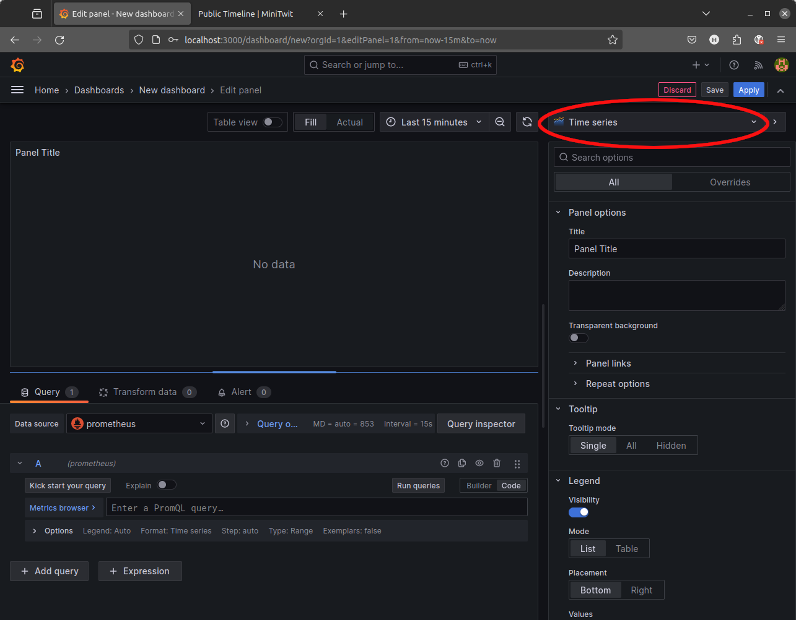
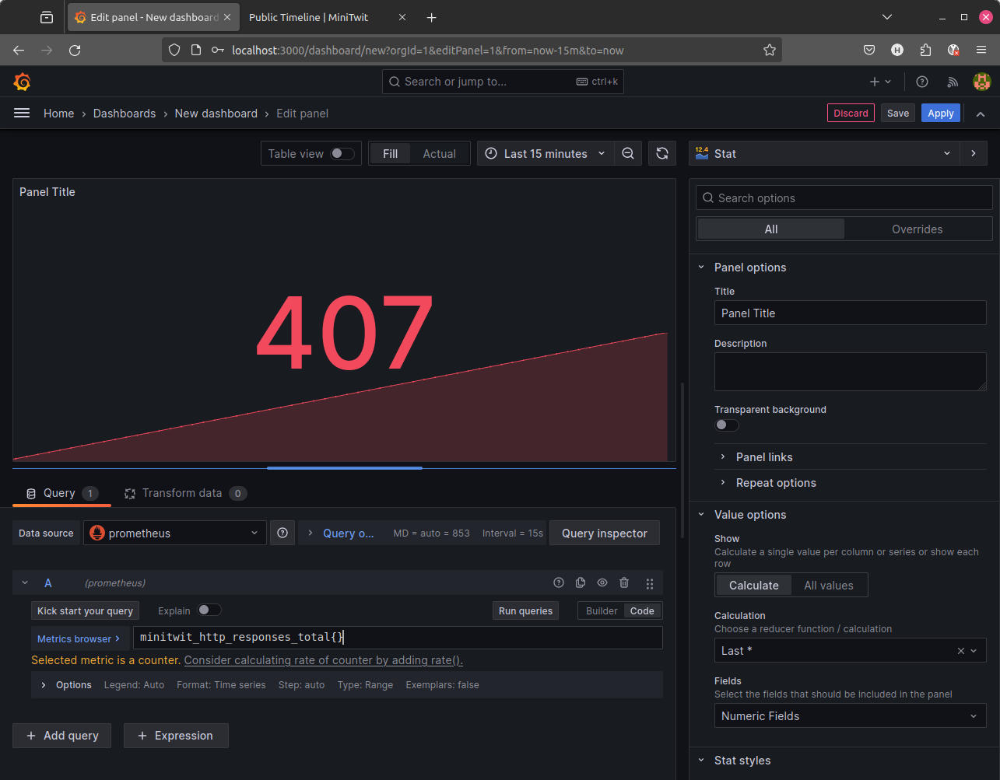
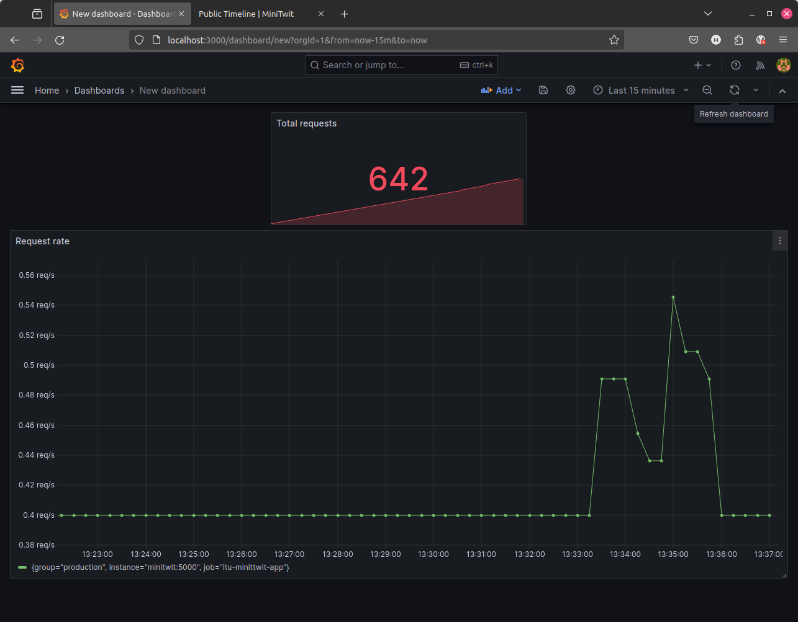
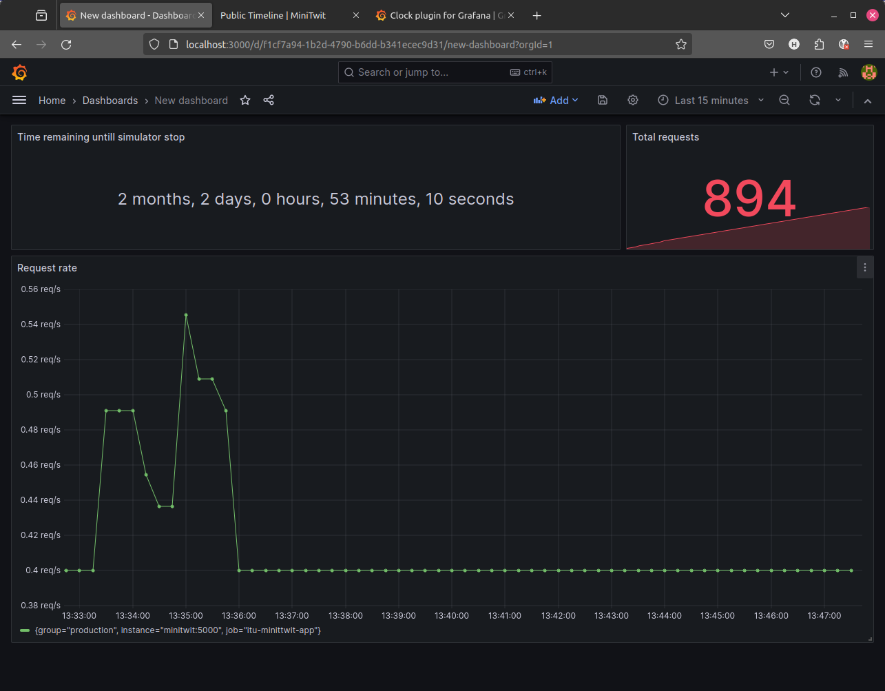

# An Exemplary Monitoring Setup for _ITU_MiniTwit_

This repository contains an exemplary monitoring setup consisting of [Prometheus](./monitoring/prometheus) and [Grafana](./monitoring/grafana).
It monitors a [basic _ITU_MiniTwit_ application (Python 3 and SQLite)](./minitwit.py), which is instrumented to collect monitoring information via the [`prometheus_client` library](https://github.com/prometheus/client_python).
So that the monitoring dashboards can show some exemplary visualizations and so that Prometheus can collect some exemplary data, this repository contains [a client](./minitwit_client_sim.py) which simulates users clicking around the front page of the _ITU_MiniTwit_ application.


## Starting the Applications

All applications in this guide are dockerized. Two Docker images have to be build.
One for the _ITU_MiniTwit_ application and one for the client simulator respectively.
Remember to replace `<youruser>` accordingly.

  * Build the application:
```bash
$ docker build -f docker/minitwit/Dockerfile -t <your_user>/minitwitserver .
```

  * Build the test client:
```bash
$ docker build -f docker/minitwit_client/Dockerfile -t <your_user>/minitwitclient .
```

Thereafter, via `docker compose`, the application, the client, Prometheus, and Grafana can be started.
All of these four systems, their configuration, and interactions are specified in the [`./docker-compose.yml` file](./docker-compose.yml):

  * Start the application:
```bash
$ docker compose up
```

Note, before invoking `docker compose`, replace Helge's name `helgecph` with your DockerHub username.
For example, one could use `sed` as in the following:

```bash
sed -i 's/helgecph/mydockerhubname/g' docker-compose.yml
```

If manually building Docker images is too tedious, all required images can be built and started in one step.
For that, the `--build` switch needs to be supplied to `docker compose`:

```bash
$ docker compose up --build
```

After starting the the application, the client, Prometheus, and Grafana, the sub-systems can be reached via the following URLs:

  * _ITU-MiniTwit_ at http://localhost:5001
  * _ITU-MiniTwit_ metrics for this node at http://localhost:5001/metrics
  * The Prometheus web-client at http://localhost:9090
  * Grafana at http://localhost:3000 (default login and password: `admin`)


## Instantiating Monitoring Dashboards and Visualizations in Grafana


### Automatic Import of Prometheus and Grafana Configuration

For this exemplary monitoring setup, there is a default data source and a dashboard with two visualizations imported to Grafana from code.
The respective files can be found [here](./monitoring/grafana/datasources/datasources.yml) and [here](./monitoring/grafana/dashboards).
The [build configuration](https://github.com/itu-devops/itu-minitwit-monitoring/blob/289226f8766d2a9a33d89b73d0cf9b093a3dba6b/docker-compose.yml#L47) in combination with the [`command` directive](https://github.com/itu-devops/itu-minitwit-monitoring/blob/289226f8766d2a9a33d89b73d0cf9b093a3dba6b/docker-compose.yml#L39) of the Prometheus Docker image illustrate how the Prometheus configuration is incorporated into the image.
The [build configuration](https://github.com/itu-devops/itu-minitwit-monitoring/blob/289226f8766d2a9a33d89b73d0cf9b093a3dba6b/docker-compose.yml#L47) of the Grafana Docker image illustrates how the configuration of data source, dashboard, and visualizations are incorporated into the image.

The purpose of this setup is to illustrate that you can import previously serialized dashboards so that they can be imported again into a new instance of a monitoring setup, e.g., when bringing up your entire system from code.


### Manual Creation of a Grafana Configuration

To build your monitoring dashboards in your project work, you want to add more visualizations and potentially more dashboards.
Therefore, we illustrate below how Grafana can be configured manually.

Navigate your browser to http://localhost:3000 and login with the default credentials `admin`/`admin`.
Remember to change the password for your projects!

Now, do the following:

  * Click `Add your first data source`
  

  * Select the `Prometheus` data source
  * Set the `Name` to a name that you deem suitable
  * Under `Connection` set the `Url` to `http://prometheus:9090`
  * Finally, scroll down to the bottom and press `Save & test`
  * If there's a `Successfully queried the Prometheus API.` message, click on `building a dashboard`
  


Navigate back to the home screen and select the already existing dashboard.
On top, click `+ Add` followed by `Add visualization`.
Then select the Prometheus data source you just added above.



The default visualization type is a  `Time series`. Change it to a `Stat`.


In the `Metrics browser`, find `minitwit_http_responses_total` and click `Run queries`.



Click on `Apply`.


This is a good point to save the dashboard using the diskette icon :)

Experiment with creating more visualizations. Try make a `Time series` that display the query `rate(minitwit_http_responses_total[$__rate_interval])`



Test what happens if you visit the _ITU_MiniTwit_ server at http://localhost:5001/public and perform some actions.

### Extending Grafana via Plugins

In case you need another panel type for example a clock and in case you are running Grafana via Docker follow the steps below.

  * Navigate to https://grafana.com/plugins?type=panel
  * Choose a panel of your liking, e.g., https://grafana.com/grafana/plugins/grafana-clock-panel/?tab=overview
  * Copy the installation command, which has to be run on the Grafana server (machine)

~~~bash
$ docker exec -it itu-minitwit-monitoring-grafana-1 /bin/bash
root@9c17c8757ffb:/# grafana cli plugins install briangann-gauge-panel
✔ Downloaded and extracted briangann-gauge-panel v2.0.1 zip successfully to /var/lib/grafana/plugins/briangann-gauge-panel

Please restart Grafana after installing or removing plugins. Refer to Grafana documentation for instructions if necessary.

root@9c17c8757ffb:/# exit
exit
$ docker restart itu-minitwit-monitoring_grafana_1
itu-minitwit-monitoring_grafana_1
~~~

´


## Stopping the Applications of this Example

The four systems, the application, the client, Prometheus, and Grafana, can be stopped with `docker compose` too:

```bash
$ docker compose down -v
```


------

This `minitwit.py` application was adapted to be monitored with Prometheus with the help of [this](https://blog.codeship.com/monitoring-your-synchronous-python-web-applications-using-prometheus/) blog post.

------

# Credits

  * 2026: [David](https://github.com/SirSorensen) added a data source and example dashboard with visualizations from code and [Patrick](https://github.com/PatNei) fixed dependency versions. Thanks a lot!
  * 2024: [Leonora](https://github.com/Herover) updated the scenario to a modern Prometheus and Grafana setup. Thanks a lot!
