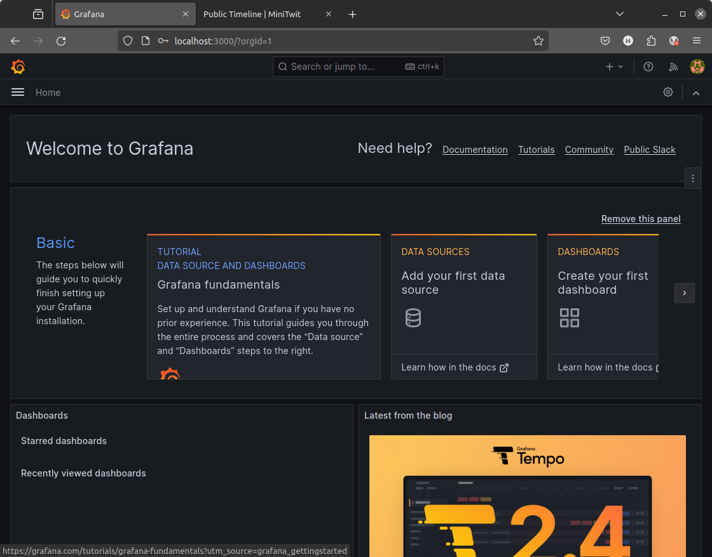
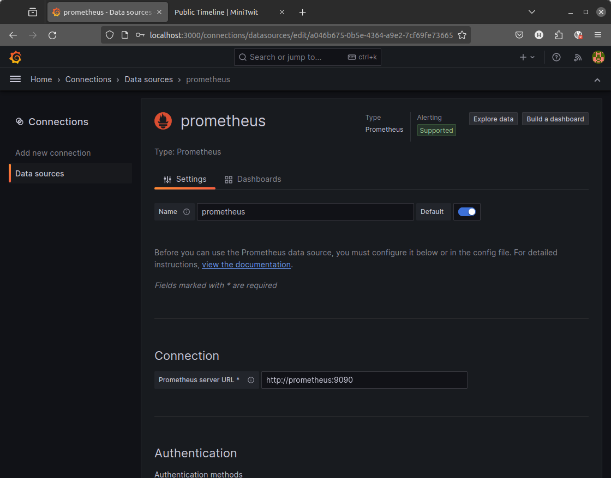
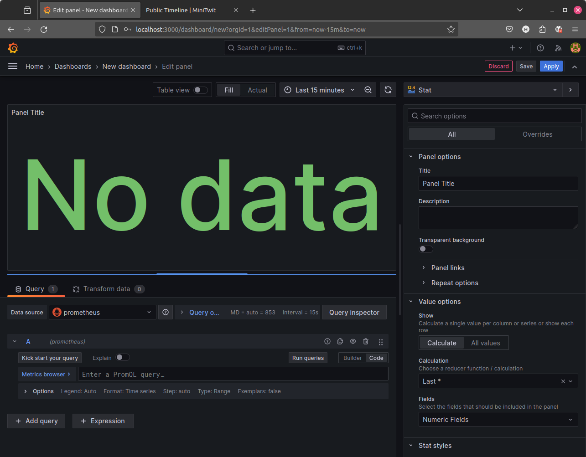
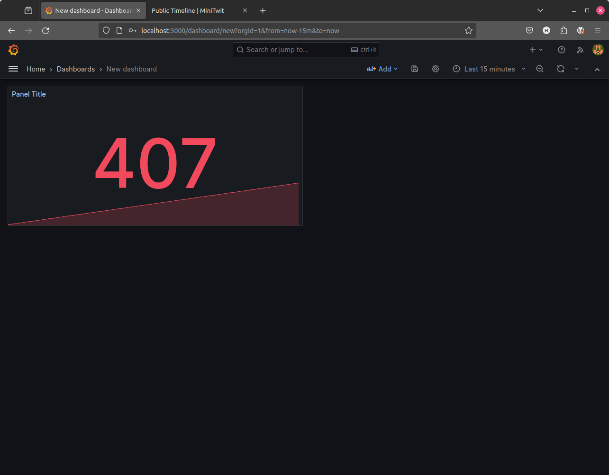

This is the basic _ITU_MiniTwit_ application (Python 3 and SQLite) with added support for monitoring with Prometheus and Grafana as a Dashboard.

The application is Dockerized. To build the application and a client which simulates users clicking around the front page you have to:

  * Build the application:
```bash
$ docker build -f docker/minitwit/Dockerfile -t <youruser>/webserver .
```

  * Build the test client:
```bash
$ docker build -f docker/minitwit_client/Dockerfile -t <youruser>/minitwitclient .
```


  * Start the application:
```bash
$ docker-compose up
```

Alternatively, you can build and run the application in one step:

```bash
$ docker-compose up --build
```


To stop the application again run:

```bash
$ docker-compose down -v
```

After starting the entire application, you can reach:

  * _ITU-MiniTwit_ at http://localhost:5000
  * _ITU-MiniTwit_ metrics for this node at http://localhost:5000/metrics
  * The Prometheus web-client at http://localhost:9090
  * Grafana at http://localhost:3000 (default login and password: `admin`)


## Starting Grafana and Instantiating a Dashboard


Navigate your browser to http://localhost:3000 and login with the default credentials `admin`/`admin`. Remember later to change the password for your projects!

Now, do the following:

  * `Add data source`
  
  * Set the `Name` to a name that you deem suitable
  * Under `Config` choose the `Type` `Prometheus`
  * Under `Http settings` set the `Url` to `http://prometheus:9090` 
  * Finally, click `Add`
  
  

Now, `Create your first dashboard`,


Add a `SingleStat` click on the `Panel Title` and choose `Edit`.




Keep `Data Source` as `default` and add the PromQL query  `minitwit_http_responses_total` to the field below.

Now, play and customize the dashboard a bit to your liking and add some other metrics.


### Installing new Panels

In case you need another panel type for example a gauge for the CPU load and in case you are running Grafana via Docker follow the steps below.

  * Navigate to https://grafana.com/plugins?type=panel
  * Choose a panel of your liking, e.g., https://grafana.com/plugins/briangann-gauge-panel/installation
  * Copy the installation command, which has to be run on the Grafana server (machine)

~~~bash
$ docker exec -it itu-minitwit-monitoring_grafana_1 /bin/bash
root@9c17c8757ffb:/# grafana-cli plugins install briangann-gauge-panel
installing briangann-gauge-panel @ 0.0.6
from url: https://grafana.com/api/plugins/briangann-gauge-panel/versions/0.0.6/download
into: /var/lib/grafana/plugins

✔ Installed briangann-gauge-panel successfully

Restart grafana after installing plugins . <service grafana-server restart>

root@9c17c8757ffb:/# exit
exit
$ docker restart itu-minitwit-monitoring_grafana_1
itu-minitwit-monitoring_grafana_1
~~~


------

This `minitwit.py` application was adapted to be monitored with Prometheus with the help of [this](https://blog.codeship.com/monitoring-your-synchronous-python-web-applications-using-prometheus/) blog post.
